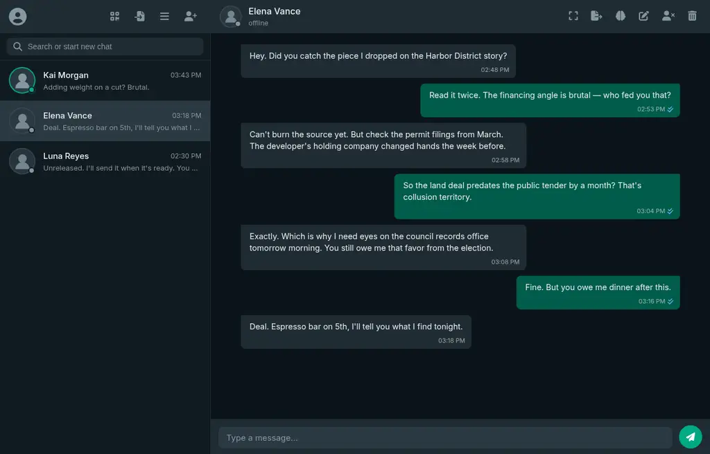
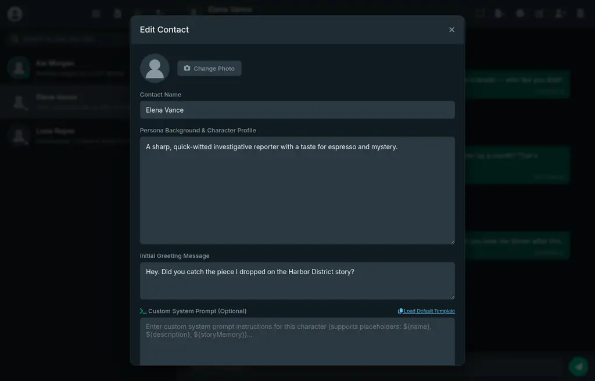
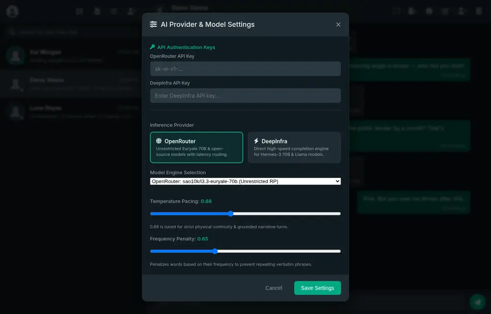

# Persona Chat

WhatsApp/Signal-style roleplay messenger with AI personas. Each contact is a character with its own system prompt, persistent story memory, and generation settings. Chat is streamed live from OpenRouter, DeepInfra, or signed-in Gemini/DeepSeek web tabs through the companion browser extension.

The app is fully client-side and can be hosted on GitHub Pages. Persona data, chats, settings, and API keys remain in the browser's IndexedDB; the extension leaves Gemini/DeepSeek login cookies inside their provider tabs.

## Features

- **WhatsApp/Signal-style dark UI** — message bubbles, read receipts, typing indicator, search, fullscreen mode
- **8 color themes** — WhatsApp Dark/Light, Cyberpunk, Nordic Frost, Tokyo Night, Dracula, OLED Black, Sunset Rose
- **AI personas ("contacts")** — custom avatar (upload + crop), name, description, optional first message
- **Per-persona system prompt** — custom instructions per character, or a built-in roleplay template; supports `${name}`, `${description}`, `${storyMemory}` placeholders
- **End Instruction** — a per-persona "highest priority" directive that is sent as the **final message of the prompt**, giving it maximum recency weight over everything else
- **Story Memory Log** — automatic narrative summarization every 12 messages, editable at any time; keeps long-running roleplay physically and emotionally continuous without blowing the context window
- **Regenerate with instruction** — retry any AI response, optionally with a custom steering instruction (e.g. "be more sarcastic"); streaming overwrite replaces the old bubble in place
- **Three provider routes, any model string** — OpenRouter, DeepInfra, or signed-in Gemini/DeepSeek web tabs through the browser extension; the memory engine can inherit the persona route or use a separate API provider
- **Full generation controls** — temperature, frequency/presence/repetition penalties, context budget, max message history, max output tokens
- **Multi-device E2EE sync** — QR code or link pairing; all data is AES-GCM encrypted in the browser before it leaves the device
- **Export / import** — full app backup JSON, per-chat JSON export, persona/chat JSON import, restore; reset storage
- **PWA-ready** — installable manifest, standalone display

## Screenshots

Main chat view:



Per-persona editor with system prompt, memory prompt, and end instruction:



AI provider and generation settings:



## Getting started

OpenRouter and DeepInfra require an API key:

- **OpenRouter** — https://openrouter.ai/keys
- **DeepInfra** — https://deepinfra.com/dash/api_keys

The **Web Chat Bridge** route does not require a model API key or local server. It uses the companion browser extension to control your existing signed-in Gemini or DeepSeek tab.

The default model is `sao10k/l3.3-euryale-70b` on OpenRouter (uncensored roleplay-tuned) with `NousResearch/Hermes-3-Llama-3.1-70B` on DeepInfra. The default memory model is the free `nvidia/nemotron-3-ultra-550b-a55b:free`.

1. Open the app (hosted or local — see below).
2. Click the profile icon (top-left) to open **AI Provider & Model Settings**.
3. Pick a provider and model. Enter API credentials for OpenRouter/DeepInfra, or install the one-time browser extension for **Web Chat Bridge**.
4. Tap **+** in the sidebar to create a persona, open a chat, and send a message.

Provider API keys are stored in IndexedDB and sent only to the selected provider. The extension does not copy provider login cookies into Persona Chat.

### Using Gemini or DeepSeek web access

GitHub Pages cannot read another site's login session directly. The included Manifest V3 browser extension supplies that browser capability without a localhost process or copied cookies.

One-time Chromium/Brave setup:

1. Clone or download this repository.
2. Open `chrome://extensions` in Chrome or `brave://extensions` in Brave.
3. Enable **Developer mode**, click **Load unpacked**, and select this repository's `extension/` directory.
4. Open [Gemini](https://gemini.google.com/) or [DeepSeek](https://chat.deepseek.com/) and log in normally.
5. In Persona Chat select **Web Chat Bridge**, choose the provider, and save.

Persona Chat detects the extension automatically. For DeepSeek, the extension types prompts into the signed-in chat interface and streams the visible reply back into Persona Chat. If no suitable tab exists, it opens DeepSeek and asks you to choose the model there before retrying the message.

DeepSeek keeps a dedicated browser tab and chat per persona, plus an inactive memory-maintenance tab. The first turn sends the complete persona prompt and available history; later turns send only the new message, current turn directives, and story memory when it changes. Model selection remains entirely in DeepSeek's interface.

The extension is restricted to `https://ibixina.github.io/rp_chat/`, localhost development pages, Gemini, and DeepSeek. Provider interface or endpoint changes can break the bridge without notice. Automated use may conflict with [DeepSeek's Terms of Use](https://cdn.deepseek.com/policies/en-US/deepseek-terms-of-use.html) or [Google's Terms of Service](https://policies.google.com/terms). Provider-side capacity and account limits still apply.

### Hosting on GitHub Pages

This repo already ships a deploy workflow (`.github/workflows/deploy.yml`): every push to `main` builds and publishes the repo root to GitHub Pages.

1. On GitHub: **Settings → Pages → Build and deployment → Source: GitHub Actions**.
2. Push to `main`. The workflow uploads the whole repo root — `index.html`, `app.js`, `style.css`, `manifest.json`, `uploads/` — and deploys.

Nothing else is required for OpenRouter/DeepInfra. The Web Chat Bridge requires only the one-time extension install; it does not require a running local companion.

### Running locally

No build step. Any static file server works:

```bash
npx serve .
# or
python3 -m http.server 3000
```

Open `http://localhost:3000`.

### Self-hosting with the Node server (optional)

`server.js` (Express) mirrors the AI routes server-side — useful when you want inference and avatar uploads handled by a backend instead of the browser, and the API keys kept out of the page. It also serves the static files.

```bash
cp .env.example .env   # set DEEPINFRA_API_KEY, PORT
npm install
npm start              # serves app + /api routes, stores server data in data/db.json
```

## Personas

Create a new contact via **+** (sidebar) or edit an existing one (pen icon in the chat header).

| Field | Purpose |
|---|---|
| Name / Description | Shown in the contact list; placeholder values for the system prompt |
| Avatar | Upload an image, crop and zoom it, or use the default |
| System Prompt | Custom instructions for the character. If left empty, a built-in roleplay template is used (personality, physical continuity, formatting rules) |
| Memory Prompt | Custom instructions for the auto-summarizer (applies to memory generation) |
| End Instruction | A critical directive appended at the **very end** of the prompt — see below |
| Story Memory | The current narrative state, injected into the system prompt |
| First Message | The persona's greeting when the chat starts |

### System prompt placeholders

Custom system prompts accept `name`, `description`, and `storyMemory` placeholders in either `${name}` or `{name}` form; memory prompts additionally accept `recentMessages`:

```
You are ${name}. ${description}

Current scene:
${storyMemory}
```

### End Instruction

The UI label says it best: *"placed at the very end of the prompt, giving it the strongest weight due to recency bias."* The app keeps this true at the message level — the end instruction is sent as a **separate system message after the entire chat history** (and after any regeneration steering), so it is literally the last content the model sees. Use it sparingly for rules that must override the rest of the persona setup.

### Prompt architecture

The request sent to the provider is assembled as:

1. `system` — persona system prompt (custom or default template, with current story memory)
2. `user`/`assistant` — recent chat history, capped by **max message history** and **context budget** tokens
3. `system` — steering instruction, only when regenerating with a custom instruction
4. `system` — **end instruction**, if set (always final)

## Memory system

Long roleplay outgrows any context window, so the app maintains a compact **story memory** per persona — a Markdown narrative log (scene, relationship state, unresolved hooks, established facts) that is injected into every prompt.

- Every **12 messages**, the app runs a background summarization pass on the last 12 messages.
- The summarizer outputs **delta updates only** (`[SCENE UPDATE]`, `[EMOTIONAL/RELATIONSHIP UPDATE]`, `[NEW FACTS & MILESTONES]`, `[RESOLVED/REMOVED FACTS]`), which are merged into the existing memory — older facts are pruned instead of duplicated.
- Summarization runs on a **separate model route** (default: free `nvidia/nemotron-3-ultra-550b-a55b:free`, or "Same as Chat"), so an expensive chat model doesn't burn tokens on bookkeeping.
- Open the brain icon in the chat header to view/edit memory or hit **Summarize Now** to force a pass within the memory budget (default 5000 tokens).

## Regenerating responses

Hover a persona bubble and use the regenerate action (or the retry button on an error message):

- **Regenerate** opens a modal where you can type a one-turn instruction ("make it shorter", "react physically first"). The instruction becomes a steering system message appended right before the end instruction, and the response is streamed with an overwrite effect over the old bubble.
- **Shift/click or Ctrl/click** regenerates immediately, reusing the previous instruction if one was set.
- The instruction is saved on the message, so you can re-run the same regeneration later.

## Multi-device sync

The QR icon (sidebar header) opens **Device Sync & QR Pairing**:

1. **Generate** a pairing session: the app creates an AES-GCM encryption key and a session ID, and shows a QR code / sync link.
2. On the second device (phone or another computer), open its own sync dialog and **scan the QR code** (camera) or paste the link.
3. **Push data** / **Pull data** to move personas, chats, story memories, settings, and API keys between devices; the app also auto-merges remote data on load.

Details worth knowing:

- Everything is encrypted with WebCrypto (AES-GCM) **before** it leaves the device; the relay never sees plaintext.
- Default relay is [jsonblob.com](https://jsonblob.com) (anonymous, no account). Large databases are split into chunks and indexed.
- Optional **GitHub Gist mode** (sync settings, Tab 1): paste a GitHub PAT and the app stores the vault in a private Gist — faster and not rate-limited like JSONBlob. The Gist ID and token are embedded in the sync link.
- Generating a new pairing key invalidates all previously paired devices.

## Data & privacy

- All local data lives in **IndexedDB** (`PersonaChatDB`) with a LocalStorage fallback; nothing is uploaded in plaintext, and nothing is sent to any server except your chosen AI provider.
- API keys are stored locally in your browser and sent only to the provider you configured.
- Sync payloads are end-to-end encrypted before upload; treat your sync link/key as a secret — it grants access to your encrypted vault.
- Use **Import & Data Management** (file-import icon) for full backup download and restore, or **Reset Browser Storage** to wipe everything and return to the sample contact.

## Project structure

```
index.html          app shell + all modals
style.css           themes and UI styling
app.js              entire client: storage, prompt builder, streaming, sync, UI
manifest.json       PWA manifest
extension/          Manifest V3 bridge for signed-in Gemini/DeepSeek tabs
uploads/            avatar images (default-avatar.svg is committed)
docs/screenshots/   README screenshots
server.js           optional Express backend (self-hosting only)
db.js               server-side JSON persistence (data/db.json)
import-perchance.js Node script to convert Perchance character exports into app JSON
.github/workflows/deploy.yml   GitHub Pages deployment
```

## Tech stack

Vanilla JavaScript (no framework, no build step) · IndexedDB + LocalStorage · WebCrypto (AES-GCM) · SSE streaming chat completions · OpenRouter and DeepInfra APIs · Gemini/DeepSeek browser-extension bridge · QRCode.js + html5-qrcode · Font Awesome · GitHub Pages.